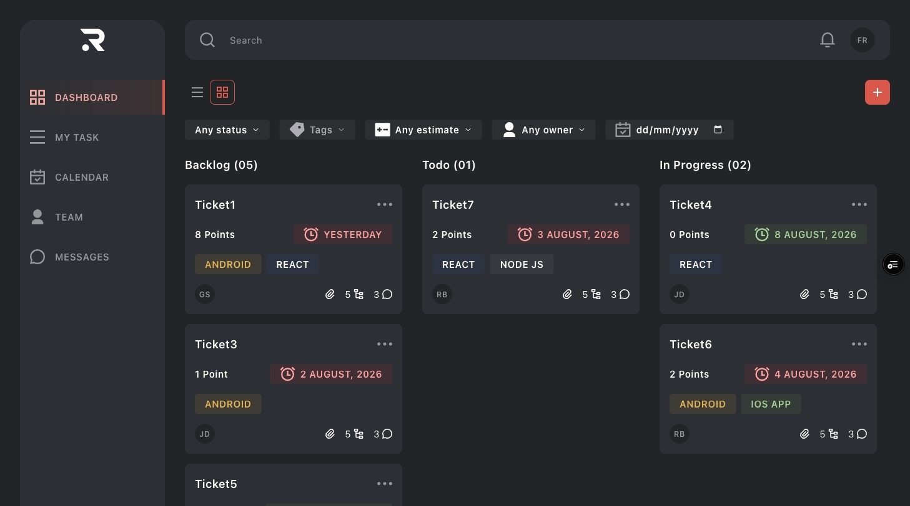
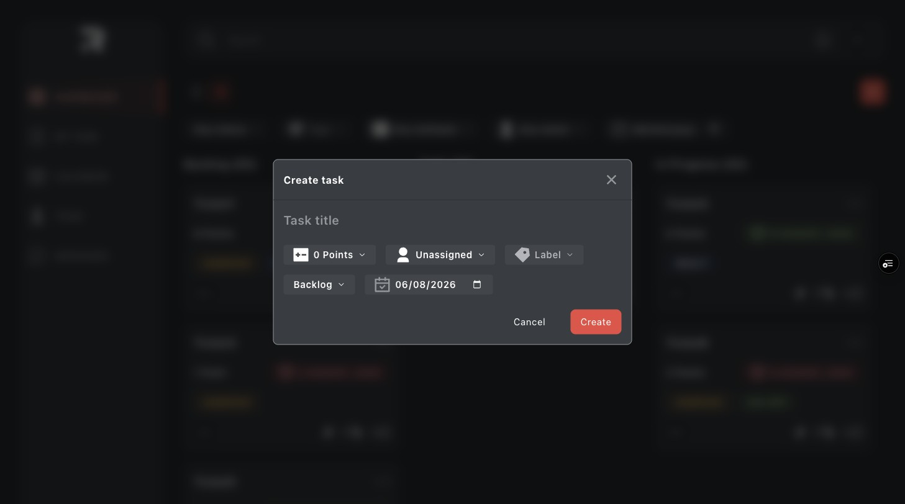
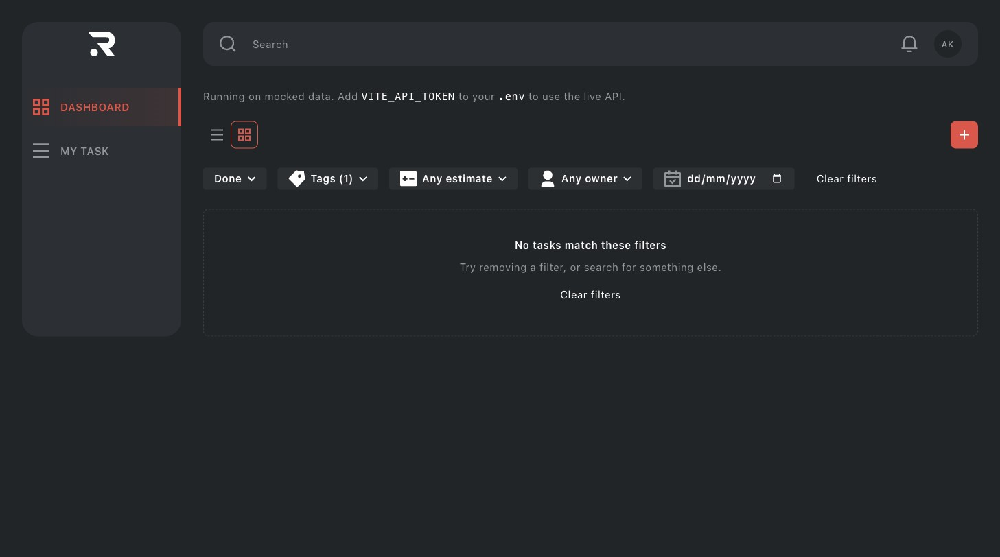
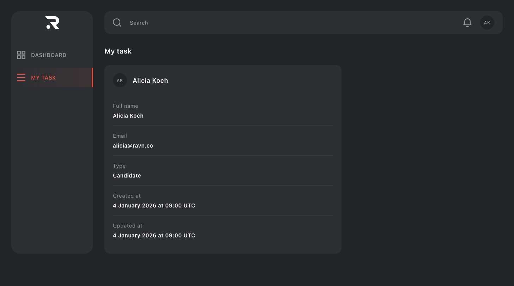
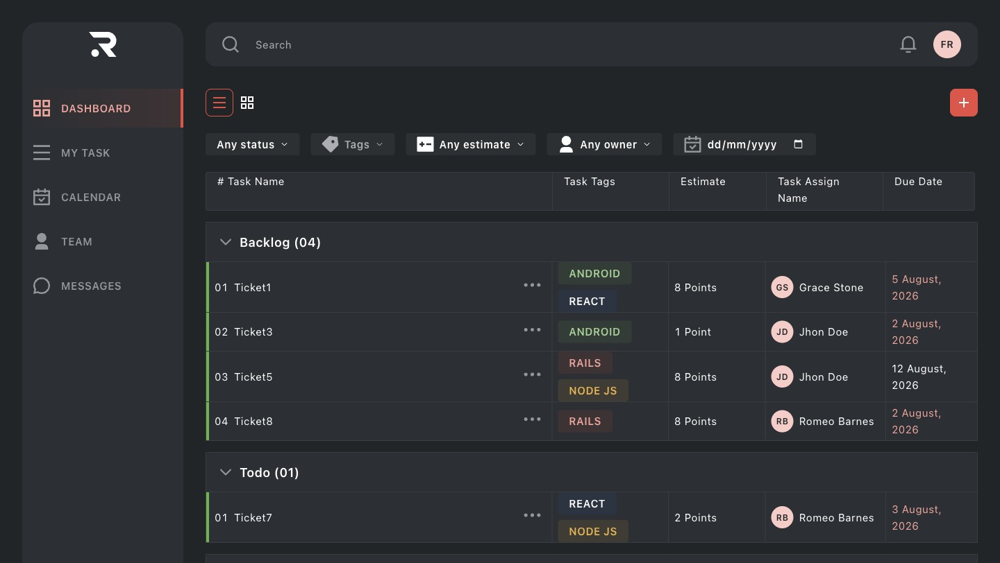

# Task Management Challenge

A task management dashboard built for the RAVN frontend code challenge: browse tasks on a
status board, create them, edit them, delete them, search and filter them, and view the
signed-in user's profile.

**[Live app](https://ravn-task-management-challenge.vercel.app)** — deployed on Vercel and
running against the real API. How it does that without publishing RAVN's token is under
[Deployment](#deployment).

Every checkbox in the brief's six sections is implemented, with two exceptions that are the
API's shape rather than choices. Both are spelled out — alongside one place the brief and
the schema simply use different names for the same working field — under
[Things the brief asks for that the API cannot do](#things-the-brief-asks-for-that-the-api-cannot-do).



## Setup

Requires Node 22.13 or newer (see `engines` in `package.json`).

```bash
npm install
npm run dev          # http://localhost:5173
```

**It runs with no configuration.** With no API token present the app serves its own mocked
data and says so on screen, so you can clone this and see a working board immediately.

To point it at the real API instead:

```bash
cp .env.example .env
# paste your token after VITE_API_TOKEN= and restart the dev server
```

The token is the one RAVN issues by email. `.env` is gitignored and no token appears
anywhere in this repository. Once both values are filled in, `npm run dev` connects to the
live API automatically and the mock banner disappears — there is no separate "live mode" to
switch on.

### Commands

| Command                | What it does                                                    |
| ---------------------- | --------------------------------------------------------------- |
| `npm run dev`          | Dev server                                                      |
| `npm run build`        | Typecheck, then production build                                |
| `npm test`             | Test suite                                                      |
| `npm run test:e2e`     | One Playwright spec against a deployment — needs `E2E_BASE_URL` |
| `npm run coverage`     | Tests with the 85% coverage gate                                |
| `npm run gate`         | Typecheck, lint, format check, coverage — what CI runs          |
| `npm run codegen`      | Regenerate GraphQL types from `schema.graphql`                  |
| `npm run schema:check` | Re-introspect the API and fail if `schema.graphql` has drifted  |

## What it does

|                                                      |                                                   |
| ---------------------------------------------------- | ------------------------------------------------- |
|  |  |
| Creating a task                                      | Filters that match nothing                        |
|            |     |
| The signed-in user                                   | The list layout                                   |

- **Board** — five status columns, task cards with name, tags, due date, points, assignee
  and an options menu. Loading, error and empty states are three distinct things.
- **Create / edit / delete** — a modal for create and edit, a confirmation for delete, and
  a notification for each outcome.
- **Search and filter** — all six filters the brief lists, sent to the API rather than
  applied to a loaded list. Filters live in the URL.
- **My task** (`/settings`) — the signed-in user, from the `profile` query. The label is
  the design's; the route is the one §6 asks for.
- **Calendar, Team, Messages** — sample pages. §2 asks the sidebar for a list of menu items
  "most of them" leading to a placeholder, which needs more destinations than the brief's
  six sections build. They are real routes inside the app shell rather than the not-found
  page: a working menu item that lands on "this page does not exist" reads as a broken link.

## Stack, and why

| Choice                                                     | Why                                                                                                                                                                                                                                                                              |
| ---------------------------------------------------------- | -------------------------------------------------------------------------------------------------------------------------------------------------------------------------------------------------------------------------------------------------------------------------------- |
| **[`@ravn/ui-kit`](https://github.com/f3r21/ravn-ui-kit)** | The Figma file for this challenge is a component library, so it was built as one — a separate package with its own Storybook, tests and CI, consumed here. See [The design system is a separate package](#the-design-system-is-a-separate-package).                              |
| **React 19 + TypeScript (strict)**                         | `any` and `@ts-ignore` are lint errors, not warnings.                                                                                                                                                                                                                            |
| **Vite 8**                                                 | Fast dev server; the build is `tsc --noEmit` then bundle, so types gate the build.                                                                                                                                                                                               |
| **Tailwind v4**                                            | RAVN's published frontend standard. Tailwind v4 configures through CSS custom properties in `@theme`, so the Figma palette becomes semantic design tokens rather than a JS config object.                                                                                        |
| **TanStack Query v5**                                      | Server state has different needs from client state — caching, deduplication, invalidation. RAVN's `state-server-vs-client` rule says to separate them, and this is the library its own examples use.                                                                             |
| **A hand-written `fetch` GraphQL client**                  | React Query already owns caching. A GraphQL client with its own normalised cache underneath it would put two sources of truth under the same task, and two places to look when the board disagrees with itself. What was actually needed is one typed function.                  |
| **graphql-codegen**                                        | Operations are typed from the schema, so reading a field a query did not select is a compile error.                                                                                                                                                                              |
| **React Aria (hooks)**                                     | Modals, menus, selects, radio groups and toasts are where accessibility is easy to get subtly wrong — focus containment and restoration, Escape, inerting the page behind, roving tabindex, typeahead. RAVN's `aria-use-react-aria-hooks` rule calls for the hooks specifically. |
| **MSW v2**                                                 | RAVN's `mock-msw-external-apis` rule. It intercepts at the network layer, so tests exercise the real client code rather than a stubbed module — and the same handlers let the app run without credentials.                                                                       |
| **Vitest + Testing Library**                               | Queries by role and label, never by test id.                                                                                                                                                                                                                                     |
| **react-router 8**                                         | §1's routing requirement. Pinned rather than caret-ranged: every 7.x release falls inside at least one published advisory range. The route table is a plain array so tests mount the real thing and navigate for real.                                                           |
| **date-fns**                                               | Parsing and validating API dates. Formatting is `Intl` with an explicit `timeZone` — see the UTC note below for why a date library reading local fields was the wrong tool for that half.                                                                                        |
| **react-stately**                                          | The state half of the React Aria hooks: collections, overlay triggers, radio groups, the toast queue.                                                                                                                                                                            |
| **clsx + tailwind-merge**                                  | One `cn` helper, so a component's own class can override a variant's instead of both landing in the output and letting source order decide.                                                                                                                                      |

Those RAVN rules are published at
[`ravnhq/ai-toolkit`](https://github.com/ravnhq/ai-toolkit) — `platform-frontend`,
`tech-react`, `design-frontend`, `tech-vitest`, `lang-typescript`.

### Structure

Organised by feature, not by type, with named exports and no barrel files — all three from
RAVN's `platform-frontend` rules.

```
src/
├── main.tsx     bootstrap: starts MSW when unconfigured, then renders
├── app/         routing, providers, query client, error boundary
├── features/    board/ · profile/ · navigation/
├── ui/          design-system pieces still owned here: button, dialog, tag, toast, …
├── graphql/     operations, the fetch client, generated types
├── lib/         cn, dates, env, assertNever, exhaustive
├── shared/      debounce
├── styles/      the token layer
├── mocks/       MSW handlers + an in-memory store
└── test/        the one render helper every test goes through
```

A component lives inside the feature that uses it, and moves to `ui/` only once something
else needs it.

## The design system is a separate package

The Figma file for this challenge is not a set of screens — it is a component library, with
a style guide, per-component specs and variant states. Building those components inline in
`src/ui/` would have meant a design system that only existed as a side effect of one app.

So it is its own package: **[`@ravn/ui-kit`](https://github.com/f3r21/ravn-ui-kit)** — 46
components and 21 icons built from the Figma export, each with Storybook stories, its own
test suite and its own CI. **[Browse the Storybook](https://f3r21.github.io/ravn-ui-kit/)**
to see every component, its props and its states without cloning anything. The count is
`node_modules/@ravn/ui-kit/dist/index.d.ts`'s 72 capitalized exports less the 21 typed
`IconProps` and 5 shared constants, so it can be re-derived rather than trusted.

This app is its first consumer, and consuming it is what proves the package
works: several real defects (a popover that could not escape an `overflow: hidden` ancestor,
a focus ring that computed a colour and painted nothing, `onAction` firing twice per menu
pick) were found only by wiring it into something real, and were fixed in the kit rather
than patched around here.

The migration is deliberately incomplete and tracked as such. `Modal`, `Select`,
`MultiSelect` and `Menu` come from the kit today; `Avatar`, `Button`, `Tag`, `Skeleton` and
the board components are still app-owned and queued to move.

`EmptyState`, the toast system and the icon set are also still app-owned, and the reason is
worth stating precisely because it is the opposite of the obvious one: the kit has all
three, and it has them **because this app wrote them first**. Its `EmptyState` and
`ToastProvider` are both marked "No Figma source" in the kit and were ported from here — the
design file draws neither, and the accessibility lessons behind them (an empty state that
must not be a live region, a toast region that has to be portalled _and_ exempted) were paid
for in this repo. So they are duplicates awaiting deletion, not gaps: the kit's versions are
supersets, and swapping to them is queued work with no user-visible change to show for it.

**`ErrorBoundary` is the only one of the four the original claim still holds for.** The kit
genuinely has no equivalent, and arguably should not: it renders nothing designed, and its
whole surface is an `onError` seam for wiring up crash reporting in a host application.

One migration is blocked rather than queued, which is a different thing. The delete
confirmation stays on the app's own `Dialog` because the kit's `Modal` accepts
`role="alertdialog"` but drops React Aria's `contentProps`, so the body text it exists to
announce is never wired to `aria-describedby` — a test here asserts that description, and
per the rule below the fix belongs in the kit rather than in the assertion.

That rule is the whole point of the arrangement: **when a kit component fails an assertion
in this app, the fix goes in the kit, not in the test.** Weakening a test to make a
migration land would throw away the only signal a second consumer-shaped repo produces.

### Why the dependency is a git tag

`@ravn/ui-kit` has no npm registry to publish to, so the dependency is the repository
itself, pinned: `"@ravn/ui-kit": "github:f3r21/ravn-ui-kit#v0.4.0"`. The kit repo is public,
so `npm ci` clones it anonymously — no cross-repo token, in CI or on Vercel. A git install
runs no build; the kit commits its `dist/` and guards its freshness in its own CI, so what
installs here is the tagged artifact rather than a rebuild.

**A tag, not a branch, and that is the whole point.** A branch re-resolves on every `npm ci`
behind an unchanged lockfile entry. A tag resolves once, and `package-lock.json` records the
commit it resolved to — so the installed bytes are identified rather than described.

This app used to hold a built copy at `vendor/ravn-ui-kit/` instead, because the kit repo was
private and reaching it from CI would have needed a PAT secret. Two things that cost, both
worth knowing if the idea ever comes back: minified output reflows on any change, so a kit
contrast fix touching a handful of hex values produced a 1,300-line diff here — 50.8% of this
repository's entire line churn was that directory. And the lockfile entry for a `file:` link
is `{"resolved": "vendor/ravn-ui-kit", "link": true}`, carrying no version and no integrity
hash, so `@ravn/ui-kit@0.3.0` named four mutually different `dist/` trees over this repo's
history with nothing able to detect it.

The alternative was a monorepo. It was not chosen because the kit is meant to outlive this
app, and a package that can only be built from inside its one consumer is not really a
package.

## Deployment

Vercel, at **[ravn-task-management-challenge.vercel.app](https://ravn-task-management-challenge.vercel.app)**,
with a preview deployment per pull request.

**Why a static SPA has a serverless function.** Vite replaces `import.meta.env.VITE_*` at
build time, which means a deployed build configured the way local development is configured
would ship RAVN's access token as a readable string in `dist/` — findable with devtools, or
with `grep`, on a public URL. There is no browser-side fix for that: the token has to reach
the API, and everything the browser can read is public. So it never reaches the browser.
`api/graphql.ts` runs on Vercel, reads `API_TOKEN` from the deployment's environment — no
`VITE_` prefix, which is exactly what would put it back in the bundle — and forwards the
query. The app posts to `/api/graphql` on its own origin carrying no credential at all.

**What that cost.** `readApiConfig` in `src/lib/env.ts` had two states, and it required a
URL and a token together — so a deployment pointed at `/api/graphql` with the token held
server-side read as "not configured", fell back to the MSW mock, and would have served
seeded data under a banner telling the visitor to edit a `.env` file they do not have. It
now has three:

|             | `VITE_API_URL` | Token    | Where                                               |
| ----------- | -------------- | -------- | --------------------------------------------------- |
| **mock**    | unset          | —        | a clone with no credentials; MSW serves seeded data |
| **direct**  | absolute       | required | local development with a filled-in `.env`           |
| **proxied** | `/api/graphql` | none     | the deployment; the server holds it                 |

The rule that a URL needs a token is unchanged rather than relaxed. It exists because an
absolute URL reaches a server that answers every query `UNAUTHENTICATED` — the app looks
broken rather than unconfigured — and a same-origin path cannot fail that way, because it
reaches this app's own origin. `//host/path` is excluded by name: it starts with a slash
and resolves somewhere else entirely.

**The endpoint is intentionally open, which is a trade rather than an oversight.** The app
has no concept of a user, so there is nothing to authenticate a caller against; anyone who
finds the URL can post a query through it. Checking `Origin` would stop nothing, since a
header is trivially set outside a browser. What the proxy does buy is that the credential
itself stays unreadable and can be rotated in one place — the difference between a misused
endpoint and a leaked token.

The rest is small. `vercel.json` rewrites everything that is not a static file or a function
to `index.html`, because `createBrowserRouter` serves `/settings` from JavaScript and a
direct hit on it would otherwise ask the host for a file that does not exist; `/api/` is
excluded so a mistyped function path 404s instead of being answered with the app's HTML.
`VITE_API_URL` is pinned in that file rather than in the dashboard, because forgetting it is
silent — the deployed board would quietly show mock data. `API_TOKEN` is the only secret,
and it only exists in Vercel's environment.

The proxy is exported as `POST`, not as a default handler. Vercel reads a default export as
Node's `(req, res) => void` and ignores what it returns, so the first deploy answered
nothing at all and hung until the platform timed it out. The export name doubles as the
method restriction: anything that is not a POST is refused before the function runs.

**Two response headers, and no Content-Security-Policy.** `vercel.json` sends
`X-Content-Type-Options: nosniff` and `Referrer-Policy: strict-origin-when-cross-origin`.
Neither can break this app — nothing here is served with a content type a browser would want
to second-guess — and the referrer policy does something real: task cards load avatars from
whatever host the API names, and without it every one of those requests carries the board's
full URL, filters and search term included, to a third party.

There is deliberately no CSP, and `frame-ancestors` is deliberately not set. A CSP would be
about eight lines and it is the thing reviewers grep for, so the reasoning matters more than
the answer. Two parts:

- **It cannot be verified before it ships.** Header rules do not apply to `vite preview` or
  `npm run dev`; the first time a policy is real is on a deployment, and a policy that is one
  directive short takes the app down in a way no local check can see beforehand. Against
  that, what a CSP defends is script injection, and this app has no `dangerouslySetInnerHTML`,
  no `eval`, no user-supplied markup and no third-party scripts — React escapes every string
  that reaches the DOM. The trade is a real outage risk against a hypothetical one.
- **Framing buys an attacker nothing here.** `frame-ancestors` stops clickjacking, and the
  action worth clickjacking is deleting a task. But `/api/graphql` is intentionally open —
  the app has no users to authenticate, so anyone who wants to delete a task can simply post
  the mutation. There is no privilege a framed click could borrow that a `curl` does not
  already have.

Both would change the moment this app grew a login. The e2e spec against the deployment (see
[Testing](#testing)) is what would catch a CSP that broke the board, so the ordering is:
users first, then the policy, with a check that can prove it.

## Decisions worth explaining

**Design tokens are read out of Figma, not eyeballed.** They live in the kit
(`@ravn/ui-kit/theme.css`), which this app imports as its single token layer — the app
defines none of its own. Colours reach a component only through a semantic name that says
what the colour is _for_ (`text-main`, `bg-surface-panel`, `border-subtle`), so a component
cannot quietly reach past the system for a raw hex. Icons are the design's own SVG exports
with the baked `fill` swapped for `currentColor`, so colour still comes from the token layer.

**The brand's own call-to-action fails WCAG AA, and it ships that way.** Three revisions of
this paragraph each fixed the previous one's arithmetic and introduced a new error, so it now
quotes the file the kit's CI enforces —
[`.storybook/a11y-allowlist.ts`](https://github.com/f3r21/ravn-ui-kit/blob/v0.4.0/.storybook/a11y-allowlist.ts)
— instead of re-summarising it. The link is pinned to `v0.4.0`, the tag this app installs, so
the quote below stays checkable against the exact tree it was read from rather than against
whatever the kit's `main` says later:

> `color-contrast` on `TextButton variant="primary"` — 14 nodes across 12 stories.
>
> `text-main` (#FFFFFF) on `bg-primary-4` (#DA584B) measures **3.83:1**, and `isSelected`'s
> `bg-primary-3` (#E27D73) **2.83:1**, against 1.4.3's 4.5:1.

Two ratios, not one: `primitives-textbutton--selected` and one of `--state-matrix`'s two nodes
are the `primary-3` pairing. And those 14 are `TextButton` alone — a further **2 nodes across
2 stories** are allowlisted separately, where `floating-popover.stories.tsx` hand-rolls its
trigger as a bare `<button className="bg-primary-4 text-main">` rather than using the
component. Sixteen accepted nodes across fourteen stories, and the split is the useful part:
fixing `TextButton` clears twelve entries at once, while the popover pair is fixable on its
own by making that story use a passing variant.

They are accepted rather than fixed because there is nowhere to move. No label colour clears
it: the darkest value in the entire palette, `neutral-5` (`#222528`), reaches only 4.02:1.
No fill clears it either, since `primary-4` is already the red ramp's darkest step. The only
remedy is a darker red — continuing the ramp's own arithmetic lands on `#D13323` at 4.99:1 —
and inventing a value the design file does not contain is precisely what the kit's
contributing rules forbid first. Repainting `--color-primary-4` instead would move every
brand surface in both repositories to satisfy one component.

So it is left as drawn, asserted in the kit's `contrast.test.ts` so it can never be mistaken
for passing, and recorded here so a reviewer running axe finds a decision rather than an
oversight. Worth being exact about the scope: the **icon** `Button`'s `primary` variant uses
the same fill and is unaffected, because an icon is non-text and 1.4.11's 3:1 threshold is
cleared at 3.83:1. This is the one place the design has a definite opinion that fails AA —
everywhere else it was silent, and the silence was resolved in favour of contrast.

**The board shows five columns where the mockup shows three.** The brief lists five
statuses; the mockup predates the schema. Five equal shares of a 1440px viewport leaves
each card around 200px, at which point the points label, date badge and tag row all wrap
and the card stops resembling the design — so columns keep the 348px width they are drawn
at and the row scrolls sideways, collapsing to two columns and then one on smaller screens.

**Search is a text field, not the button Figma draws.** The mockup renders the whole search
bar as a `<button>` containing the word "Search". That is a mockup convention; a button
would not accept typing.

**Filters live in the URL.** A filtered board can be linked and bookmarked, and a reload
does not silently reset to "everything" while the controls still look set. It is also what
lets the search box in the app shell drive a query on the page without either side importing
the other. Every value read back out is validated first — enums against their member list,
`due` as a real calendar date, `owner` against the directory — because a hand-edited
`?status=nonsense` or `?due=nonsense` would otherwise reach the API and be rejected, turning
a typo in a shared link into an error screen.

Filter changes _replace_ the history entry rather than pushing one, so a single back press
leaves the board instead of retracing every keystroke. That is a deliberate trade: the
board is linkable but the back button is not a filter undo.

**Dates are read in UTC.** The API types `dueDate` as a `DateTime` but uses it as a date:
the values it returns sit at midnight UTC. Interpreting those in the viewer's local zone
moves them — west of Greenwich a task due tomorrow renders as "Yesterday", in overdue red.
The whole test suite therefore runs at **UTC+14**, so any code reaching for a local calendar
field fails a test rather than shipping.

That pin is necessary and not sufficient, which took a bug to learn. UTC+14 is a _fixed_
offset, so it cannot catch anything that depends on daylight saving — and the original
implementation reconstructed the UTC clock by writing those fields into a local `Date`,
which lands on a time that does not exist in any zone that skips an hour. Formatting now
goes through `Intl` at an explicit `timeZone`, and the tests switch zone deliberately to
cover it.

**The failure a user can act on is different from the one they cannot.** GraphQL answers
`200 OK` with an `errors` array, so "did this work" is not a status code. A rejected token
is called out specifically and offers no retry button, because retrying cannot fix it;
anything else can be retried.

## Things the brief asks for that the API cannot do

- **§6 asks the settings page to show `Position`.** `User` has no such field. It exposes
  `id`, `fullName`, `email`, `avatar`, `type`, `createdAt` and `updatedAt` — confirmed
  against the live endpoint's own introspection response, not inferred. The other five
  requested fields are all shown. Inventing a sixth seemed worse than saying this.

  Worth separating from the other `Position`: **§4's editable position is a different
  field and it does exist.** `Task.position` is a `Float` and `UpdateTaskInput` accepts
  it, so the edit modal sets it. Only `User.position` is missing.

- **`CreateTaskInput` has no `position`.** The server assigns it on create, so the field
  appears in the edit modal only — a control on create would collect a value with nowhere
  to send it.

Those are the two. A third difference is listed here because it is the same kind of
surprise, but it costs nothing:

- **§5 calls the points filter `EstimatedPoints`.** The field is `pointEstimate`. The
  schema wins, and the filter itself works exactly as asked — only the name differs.

## Bonus items

Three of the five:

- **Task count per column** — the design draws it (`In Progress (03)`), zero-padded.
- **Due-date colour by urgency** — red when overdue, amber when due today or tomorrow. The
  brief suggests green for on-time; this uses the design's neutral badge instead, because
  green is already the `iOS app` tag colour and a green badge sitting above a green chip
  reads as a relationship that is not there.
- **A list layout as well as the board** — each status becomes a full-width section and
  each task a single row, rather than the same card stacked. Worth being precise about why
  that distinction matters: the board is _already_ one stacked column at narrow widths, so
  a list view built by stacking would have been a switcher that did nothing on a phone.

Drag-and-drop was left out for scope, not difficulty — and it is worth being precise about
that, because the easy excuse would be accessibility. The installed React Aria ships the
whole accessible drag story: a keyboard mode, drop-target navigation and localised screen
reader announcements. The obstacle was the collection layer each column would need, not the
keyboard. A task's status and its position within a column can both be changed from the
options menu, which exercises the same `updateTask` mutation a drop would.

## Testing

287 tests. `npm run gate` runs typecheck, lint, format check and coverage against an 85%
threshold on every metric; CI runs the same thing, plus a production build, a bundle-size
budget and `npm audit --audit-level=high`, on every pull request.

Dependencies get a second look on the way in. A separate `Dependency review` workflow fails
a pull request that introduces a package carrying a high-severity advisory in GitHub's
database — a different feed from npm's, read against the diff rather than the installed
tree, so it names the dependency this change added. That matters here because Dependabot
opens _grouped_ bumps, and a group is exactly where one bad package rides in behind fourteen
harmless ones. The two checks share a severity threshold on purpose: two gates disagreeing
about what counts as a problem is how a pipeline stops being read.

The suite pins `VITE_API_URL`/`VITE_API_TOKEN` empty in `vite.config.ts`'s `test.env`, so it
always runs against the MSW mock. That is not belt-and-braces — Vitest loads `.env` through
Vite like any other build, and `.env` here is gitignored and per-developer, so without the
pin two tests passed or failed depending on whether the machine running them happened to
have real credentials configured. CI never saw it, because CI has no `.env`.

A few conventions:

- **No test ids.** Queries go through role, label and text — the things a user perceives.
- **MSW runs with `onUnhandledRequest: 'error'`,** so a missing handler fails the test
  loudly rather than falling through to the network and passing against live data.
- **The mock store behaves like a server** — a created task appears in the next query,
  filters genuinely narrow, deletes remove. A fixed list would let a broken cache
  invalidation pass its own test. It is excluded from the coverage _metric_ (it is a test
  double; counting it moves the number by the fake's complexity rather than the app's) but
  unit-tested directly, because the filter tests trust it to behave like the real API.

Several defects here were found only by driving the app in a real browser rather than
trusting jsdom — a multi-select that cleared previous selections on each pick, an Escape
key that closed a dialog along with the dropdown inside it, and an unhandled promise
rejection every test happily passed through. Each has a regression test now.

**One end-to-end spec, against a deployment.** `e2e/deployed-proxy.spec.ts` creates a task,
filters the board to it, edits it and deletes it, in a real browser, against a real Vercel
URL. It is the only test in the repository that touches `api/graphql.ts` as it actually
runs: nothing imports that file — the app posts to a URL — so no amount of unit testing
reaches it. It has already failed in a way only this could catch, exported as a default
handler that Vercel read as `(req, res) => void`, discarding the `Response` and hanging
every request while the types, the unit test and the local build all stayed green.

`E2E_BASE_URL` is required and has no default, localhost least of all: a fallback to
`npm run dev` would make this a slow, flaky duplicate of the suite above, passing while
proving nothing about a deployment. The last assertion checks that the run actually went
through `/api/graphql`, which is what makes a local run fail on purpose — pointing it at a
dev server is useful only for proving the selectors still match after a UI change.

It is one spec, not a suite, and that is a decision rather than a stopping point. Every
additional flow would re-test components jsdom already covers, at a hundred times the cost,
and would write to a board RAVN can see — so the spec removes what it created even when it
fails partway through.

`.github/workflows/e2e.yml` runs it on every successful deployment, and can be dispatched by
hand against any URL. The automatic half only fires once the workflow file is on `main`,
because that is GitHub's rule for `deployment_status` events; the manual half is what makes
it usable before then.

The traffic goes both ways, which is the more useful lesson. jsdom does not reflect the
`inert` property to an attribute and does not evaluate media queries, so it will call a
hidden notification reachable and show two navigation landmarks where a browser shows one.
A browser, in turn, will report focus dropped on `<body>` if the interaction is driven with
`element.click()` instead of real input, because that is not the press sequence React Aria
listens for. Anything about focus or the accessibility tree is checked in both.

## Notes

- **The schema is pinned, not fetched.** `schema.graphql` is committed and
  `npm run schema:check` re-introspects the API to prove it has not drifted. Codegen reads
  the file, so neither it nor CI needs network access or a credential.
- **History** is one branch and one pull request per unit of work, throughout. The brief
  itself shipped as eight stacked branches — §1, §2, §3 read, §3 create, §4, §5, §6, and
  the README — eight for six sections, because §3 is large enough to split and the README
  is a graded deliverable of its own. Each was revised after an adversarial review; the
  fixes are in the commit messages. Everything since has arrived the same way and the
  count keeps climbing, so `gh pr list --state all` is the answer rather than a number
  written here: work now branches off `dev` and merges back by pull request with CI green,
  which a repository ruleset enforces rather than trusting to habit.

## AI Tooling (Claude Code)

This repository is heavily instrumented for AI development via [Claude Code](https://github.com/anthropics/claude-code). The configuration ensures AI agents adhere strictly to the project's quality standards without hallucinations or context bloat:

- **Modular Rules (`.claude/rules/`)**: Context-aware instructions (`bonus-points.md`, `code-review.md`, `graphql-api.md`, `ui-kit.md`) loaded as plain project context, restating the conventions in `CLAUDE.md`. `ui-kit.md` carries the one rule that governs the design-system boundary — a kit component that fails an assertion here is fixed in the kit, never in the test — which until now lived only in per-machine agent memory.
- **Automated Hooks (`.claude/hooks/`, wired up in `.claude/settings.json`)**: both read their event payload as JSON on stdin, which is the only way a hook is given one.
  - `PostToolUse` → `format-file.sh`: runs this repo's own ESLint and Prettier over the file Claude just saved, so a formatting slip never reaches `npm run gate`.
  - `PreToolUse` → `block-dangerous.sh`: refuses a handful of irreversible bash commands — a recursive forced `rm` aimed at `/` or `$HOME`, a plain force push, a download piped into a shell — by returning a `deny` decision, not by exiting non-zero, which Claude Code treats as a non-blocking error and runs the command anyway. `scripts/hooks.test.mjs` drives both scripts the way Claude Code drives them, because a hook that does nothing exits 0 exactly like a hook that works. Nothing enforces `gate` before a commit — running it is on you. A repository ruleset does enforce it before a merge: `main` and `dev` take changes by pull request only, with CI green against an up-to-date branch, and no force-push or deletion.
- **Permissions (`.claude/settings.json`)**: Playwright and Chrome DevTools are whitelisted to run headless tests silently without interrupting the agent, and `permissions.deny` keeps `package-lock.json`, `coverage/`, `dist/` and `node_modules/` out of context — through the Read, Edit, Glob and Grep tools and through the shell's own readers alike.

## License

[MIT](LICENSE).
