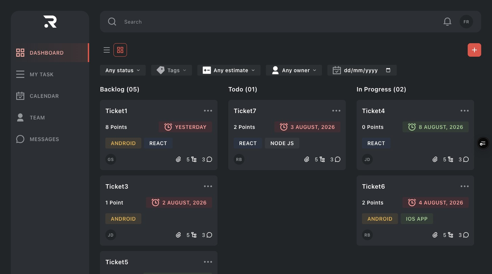
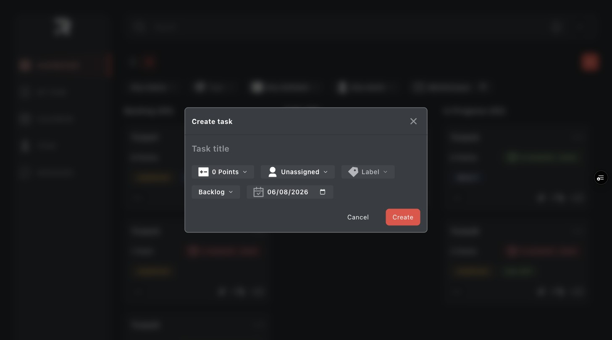
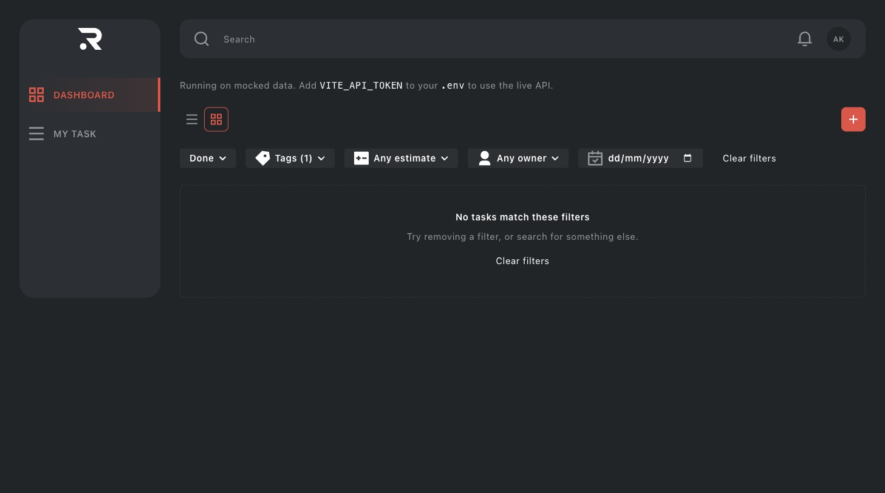
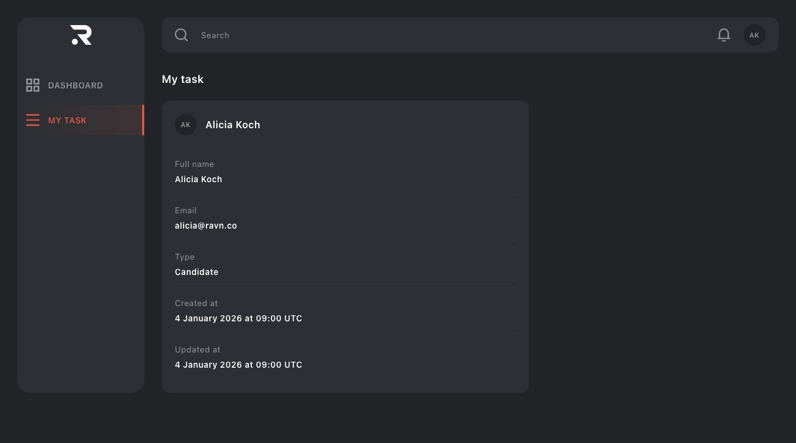
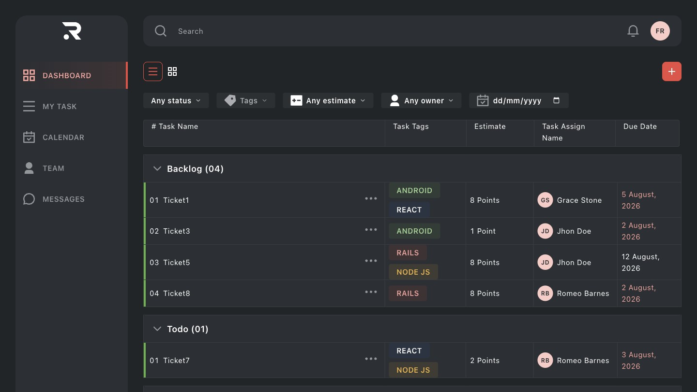

# Task Management Challenge

This is a task management dashboard for the RAVN frontend code challenge. You can browse
tasks on a status board. You can create, edit, and delete tasks. You can search and filter
tasks. You can view the signed-in user's profile.

**[Live app](https://ravn-task-management-challenge.vercel.app)** — this app runs on Vercel.
Until October 2026 it reached RAVN's API through a proxy that kept the token off the page.
That API has since gone offline, so the deployment now serves the same seeded mock data a
fresh clone does, with a banner that says so. [Deployment](docs/deployment.md) explains both,
and how to switch back.

This app meets every checkbox in the brief's six sections except one. §6 asks the settings
page to show a `Position` field. The `User` type has no such field.
[Things the brief asks for that the API cannot do](#things-the-brief-asks-for-that-the-api-cannot-do)
explains this gap. It also explains two places where the brief's wording differs from the
schema's wording, at no cost.



## What it does

|                                                                                                         |                                                   |
| ------------------------------------------------------------------------------------------------------- | ------------------------------------------------- |
|                                                     |  |
| Creating a task                                                                                         | Filters that match nothing                        |
|                                                               |     |
| The signed-in user, captured 2026-08-09 before "My task" became its own page. Email redacted, see below | The list layout                                   |

The email field in that screenshot reads `[email redacted]`. The API's seeded profile
belongs to a real person at RAVN. This repository is public, so the screenshot masks the
address instead of publishing it. No other screenshot is altered. All five were captured on
2026-08-09 from the deployed build while it still reached RAVN's API. The deployment now
serves seeded mock data, so its tasks and signed-in user differ from these images.

- **Board** — five status columns. Each task card shows a name, tags, a due date, points,
  an assignee, and an options menu. Loading, error, and empty states are three separate
  states.
- **Create, edit, delete** — one modal handles create and edit. A confirmation dialog
  handles delete. Each action shows a notification.
- **Search and filter** — the app supports all six filters the brief lists. The app sends
  each filter to the API. It does not filter an already-loaded list. Filters live in the
  URL.
- **My task** (`/my-task`) — the signed-in user's own tasks, filtered server-side by
  `assigneeId` rather than `ownerId`; the two are not interchangeable — see app#155.
  §6 asks for this route; the sidebar used to point it at the profile page below
  instead, on a literal reading of the brief's label that did not survive contact
  with what "my task" actually means.
- **Settings** (`/settings`) — the signed-in user from the `profile` query, reached
  from the header avatar now that the sidebar's "My task" item points at the list
  above.
- **Calendar, Team, Messages** — these are sample pages. §2 asks the sidebar to list menu
  items. Most of them should lead to a placeholder page. The brief's six sections do not
  build that many destinations. These three are real routes inside the app shell. They are
  not the not-found page. A working menu item that lands on "this page does not exist"
  looks like a broken link.

## Setup

This app requires Node 22, at or above 22.13.0. `engines` in `package.json` sets
`^22.13.0`. `.nvmrc` pins `22`. CI installs Node straight from `.nvmrc`. Trust those two
files, not this sentence.

```bash
npm install
npm run dev          # http://localhost:5173
```

Supported browsers: **Chrome 111, Edge 111, Firefox 128, Safari 16.4, iOS Safari 16.4**.
`package.json`'s `browserslist` declares this list — run
`node -p "require('./package.json').browserslist.join(', ')"` to print it. Vite converts
this same list into its build target. ESLint converts it into a lint over `src/`. So the
build target and the lint floor always agree. Firefox is 128, not Vite's default of 114,
because Tailwind v4 requires 128. The lower number did not match what the stylesheet needs.

**This app runs with no configuration.** A fresh clone has no API configured. A half-filled
`.env` file also counts as unconfigured. In both cases, the app serves its own mock data. It
shows a banner that says so on screen. So you can clone this app and see a working board
right away.

To point it at the real API instead (offline since October 2026, see
[Deployment](docs/deployment.md)):

```bash
cp .env.example .env
# paste your token after VITE_API_TOKEN= and restart the dev server
```

RAVN issues this token by email. `.gitignore` excludes `.env`. No token appears anywhere in
this repository. Once you fill in both values, `npm run dev` stops serving mock data and
calls that URL directly, and the banner disappears. While RAVN's API is offline, the board
then shows its error state instead of tasks. There is no separate "live mode" switch.

### Commands

| Command                | What it does                                                                                                                           |
| ---------------------- | -------------------------------------------------------------------------------------------------------------------------------------- |
| `npm run dev`          | Dev server                                                                                                                             |
| `npm run build`        | Typecheck, then production build                                                                                                       |
| `npm test`             | Test suite                                                                                                                             |
| `npm run test:e2e`     | One Playwright spec against a deployment; needs `E2E_BASE_URL` and the API, so it cannot pass while the API is offline                 |
| `npm run coverage`     | Tests with the 85% coverage gate                                                                                                       |
| `npm run gate`         | Typecheck, lint, format check, coverage. CI runs this, then a build, the CSS canary, a bundle budget and a production dependency audit |
| `npm run codegen`      | Regenerate GraphQL types from `schema.graphql`                                                                                         |
| `npm run schema:check` | Re-introspect the API and fail if `schema.graphql` has drifted (needs the API, offline since October 2026)                             |
| `npm run css:canary`   | Fail if kit-only Tailwind classes did not reach the built CSS                                                                          |

## Stack, and why

| Choice                                                     | Why                                                                                                                                                                                                                                                                                                                                                                                           |
| ---------------------------------------------------------- | --------------------------------------------------------------------------------------------------------------------------------------------------------------------------------------------------------------------------------------------------------------------------------------------------------------------------------------------------------------------------------------------- |
| **[`@ravn/ui-kit`](https://github.com/f3r21/ravn-ui-kit)** | The Figma file for this challenge is a component library. So the team built it as one: a separate package with its own Storybook, tests, and CI. This app consumes that package. See [The design system is a separate package](docs/design-system.md).                                                                                                                                        |
| **React 19 + TypeScript (strict)**                         | `any` and `@ts-ignore` are lint errors. They are not warnings.                                                                                                                                                                                                                                                                                                                                |
| **Vite 8**                                                 | Vite gives a fast dev server. The build runs `tsc --noEmit`, then bundles. So type errors block the build.                                                                                                                                                                                                                                                                                    |
| **Tailwind v4**                                            | This is RAVN's published frontend standard. Tailwind v4 reads configuration from CSS custom properties in `@theme`. So the Figma palette becomes semantic design tokens, not a JS config object.                                                                                                                                                                                              |
| **TanStack Query v5**                                      | Server state needs different handling than client state: caching, deduplication, invalidation. RAVN's `state-server-vs-client` rule requires this separation. RAVN's own examples use this library.                                                                                                                                                                                           |
| **A hand-written `fetch` GraphQL client**                  | React Query already owns caching. A GraphQL client with its own normalized cache would add a second source of truth. It would also add a second place to check when the board looks wrong. This app needed one typed function instead.                                                                                                                                                        |
| **graphql-codegen**                                        | Codegen types each operation from the schema. So reading a field a query did not select causes a compile error.                                                                                                                                                                                                                                                                               |
| **React Aria (hooks) + react-stately**                     | Modals, menus, selects, radio groups, and toasts are easy to get subtly wrong on accessibility: focus containment, focus restoration, the Escape key, inerting the page behind, roving tabindex, typeahead. RAVN's `aria-use-react-aria-hooks` rule requires these hooks specifically. react-stately provides their state half: collections, overlay triggers, radio groups, the toast queue. |
| **MSW v2**                                                 | RAVN's `mock-msw-external-apis` rule requires MSW. MSW intercepts requests at the network layer. So tests exercise the real client code, not a stubbed module. The same handlers let the app run without credentials.                                                                                                                                                                         |
| **Vitest + Testing Library**                               | Queries by role and label, never by test id.                                                                                                                                                                                                                                                                                                                                                  |
| **react-router 8**                                         | §1 requires routing. This app pins the version exactly, at 8.3.0, the first 8.x release outside GHSA-qwww-vcr4-c8h2, instead of using a caret range. The route table is a plain array. So tests mount the real route table and navigate for real.                                                                                                                                             |
| **date-fns**                                               | This app uses date-fns to parse and validate API dates. It uses `Intl` with an explicit `timeZone` to format dates. See the UTC note below. It explains why a date library that reads local fields was the wrong tool for formatting.                                                                                                                                                         |
| **clsx + tailwind-merge**                                  | One `cn` helper, so a component's class can override a variant's class instead of both landing in the output.                                                                                                                                                                                                                                                                                 |

RAVN publishes these rules at [`ravnhq/ai-toolkit`](https://github.com/ravnhq/ai-toolkit):
`platform-frontend`, `tech-react`, `design-frontend`, `tech-vitest`, `lang-typescript`,
`figma-to-react-components`.

### Structure

This app organizes code by feature, not by type. It uses named exports. It has no
hand-written barrel files, and lint bans importing the one codegen emits. RAVN's
`platform-frontend` rules require all three.

```
src/
├── main.tsx     bootstrap: starts MSW when unconfigured, then renders
├── app/         routing, providers, query client, error boundary
├── features/    board/ · profile/ · navigation/
├── ui/          app-level pieces: async section, empty state, error boundary, toast
├── graphql/     operations, the fetch client, generated types
├── lib/         cn, dates, env, assertNever, exhaustive, the current-day hook, the dead-avatar filter
├── shared/      debounce
├── styles/      the token layer
├── mocks/       MSW handlers + an in-memory store
└── test/        the shared render helper and the kit smoke test
```

A component lives inside the feature that uses it. It moves to `ui/` only when another
feature needs it too.

## Bonus items

The brief lists five bonus items. This app builds three:

- **Task count per column** — the design shows this as `In Progress (03)`. The count is
  zero-padded.
- **Due-date colour by urgency** — this app builds all three tiers the brief lists. The
  badge is neutral when the deadline is two or more days away, yellow when it is today or
  tomorrow, and red once it has passed. Colour is never the only signal. The badge always
  states the date in words: "Today", "Tomorrow", "Yesterday" or the full date. For screen
  readers, the kit also adds a visually hidden ", due soon" or ", overdue" after it.
- **A list layout, in addition to the board** — each status becomes a full-width section.
  Each task becomes a single row, not a stacked card. This distinction matters for a
  specific reason. The board already collapses to one stacked column at narrow widths. A
  list view built the same way would do nothing new on a phone.

This app leaves out drag-and-drop for scope reasons, not difficulty. Accessibility is not
the reason, and it matters to be precise about that. The installed React Aria library ships
the whole accessible drag story already: a keyboard mode, drop-target navigation, and
localized screen-reader announcements. The real obstacle was the collection layer each
column would need, not the keyboard. You can change a task's status, and its position
within a column, in the Edit dialog that the card's options menu opens. Saving calls the
same `updateTask` mutation a drop would call.

## Things the brief asks for that the API cannot do

- **§6 asks the settings page to show a `Position` field.** The `User` type has no such
  field. It exposes only `id`, `fullName`, `email`, `avatar`, `type`, `createdAt`, and
  `updatedAt`. Run `awk '/^type User /,/^}/' schema.graphql` to print exactly those seven
  fields. That file is the schema as introspected while the API was online; the endpoint has
  answered 404 since October 2026, so `npm run schema:check` cannot confirm it now. This app
  shows the other five requested fields. Inventing a sixth field seemed worse than stating
  this gap.

  **§4's editable position is a different field, and it does exist.** Do not confuse it
  with the field above. `Task.position` is a `Float!` field. `UpdateTaskInput` accepts it
  as a nullable `Float`. The edit modal sets this field. Only `User.position` is missing.

This is the only checkbox the API's shape prevents. Two more differences follow. Both are
the same kind of surprise. Neither one costs anything:

- **§5 calls the points filter `EstimatedPoints`.** The schema names this field
  `pointEstimate` instead. This app follows the schema's name. The filter itself works
  exactly as the brief asks. Only the name differs.

- **`CreateTaskInput` has no `position` field, and the brief never asks for one on
  create.** The server assigns this value automatically. So the field appears only in the
  edit modal, which is where §4 asks for it. A control on the create modal would collect a
  value with nowhere to send it.

## Decisions worth explaining

**Design tokens come from Figma directly. No one eyeballs them.** They live in the kit, at
`@ravn/ui-kit/theme.css`. This app imports that file as its only token layer. The app
defines no tokens of its own. A colour reaches a component only through a semantic name.
That name states what the colour is for, such as `text-main`, `bg-surface-panel`, or
`border-subtle`. So a component cannot reach past the system for a raw hex value. Icons are
the design's own SVG exports. Each one has its baked `fill` value swapped for
`currentColor`. So icon colour also comes from the token layer.

**The brand's call-to-action button fails WCAG AA. It ships this way on purpose.**
`text-main` (#FFFFFF) on `bg-primary-4` (#DA584B) measures 3.83:1. WCAG 1.4.3 requires
4.5:1. The selected state measures 2.83:1. No colour in the palette fixes this. The darkest
label colour, `neutral-5` (#222528), only reaches 4.02:1. `primary-4` is already the
darkest red in the ramp. The only fix is a darker red. That is a brand change, not one this
challenge can make.

**The board shows five columns. The mockup shows three.** The brief lists five statuses.
The mockup predates the schema. Five equal columns on a 1440px viewport would break the
card layout. So each column keeps the 348px width the design draws. The row scrolls
sideways instead. On smaller screens, the row collapses to two columns, then to one.

**Search is a text field, not the button Figma draws.** The mockup renders the whole search
bar as a `<button>` element containing the word "Search". That is only a mockup convention.
A real button cannot accept typed text.

**Filters live in the URL.** So you can link or bookmark a filtered board. A reload does
not silently reset the board to "everything" while the controls still look set. This design
also lets the search box in the app shell drive a query on the board page, without either
side importing the other. This app validates every value it reads back from the URL. It
checks each enum against its member list. It checks `due` as a real calendar date. It checks
`owner` against the user directory. Without this check, a hand-edited `?status=nonsense` or
`?due=nonsense` would reach the API and get rejected. A typo in a shared link would then
turn into an error screen.

Each filter change replaces the current history entry. It does not push a new one. So one
back-button press leaves the board, instead of retracing every keystroke. This is a
deliberate trade-off. The board stays linkable, but the back button does not undo a filter.

**This app reads dates in UTC.** The API types `dueDate` as a `DateTime` field, but uses it
as a plain date. Each value it returns sits at midnight UTC. Reading that value in the
viewer's local zone would shift it. West of Greenwich, a task due tomorrow would then
render as "Yesterday", in overdue red. So the whole test suite runs at **UTC+14**. Any code
that reads a local calendar field instead of UTC fails a test, instead of shipping a bug.
That pin is not enough on its own. UTC+14 is a _fixed_ offset. It cannot catch a bug that
depends on daylight saving. The original code reconstructed a UTC clock by writing date
fields into a local `Date` object. On a day that skips an hour, that produces a time that
does not exist in any time zone. Formatting now goes through `Intl`, with an explicit
`timeZone`. Tests also switch time zone on purpose, to cover this case.

**A failure a user can fix is different from one they cannot fix.** GraphQL always answers
`200 OK`, even on failure. It reports failure through an `errors` array instead. So "did
this work" is never a status code. This app calls out a rejected token specifically. It
shows no retry button for that error, because retrying cannot fix it. Every other error
shows a retry button.

## Deeper reading

Three topics need more detail than a first read gives them. Each one has its own file:

- **[The design system](docs/design-system.md)** — why the components are a separate
  package (`@ravn/ui-kit`), what it ships, and how the boundary is enforced.
- **[Deployment](docs/deployment.md)** — Vercel, and why a static SPA needs one serverless
  function to keep RAVN's token out of the bundle.
- **[Testing](docs/testing.md)** — what `npm run gate` checks, what the suite covers, and
  the conventions behind it.

## Product, design and QA

What the app is for, how it looks and how it is tested, each read back after the build and
dated 2026-10-06:

- **[Product](docs/product.md)**: the proto-persona (an assumption), what was built and cut,
  the go/no-go for production, and what comes next.
- **[Design](docs/design.md)**: the data flow, the loading, empty, error and success state of
  each screen, and where the build differs from Figma.
- **[QA](docs/qa/test-plan.md)**: the test plan with entry and exit criteria, the
  [risk register](docs/qa/risk-register.md), and the [test map](docs/qa/test-map.md) of what
  each suite proves and does not prove.
- **[Usability interviews](docs/research/usability-pilot.md)**: P1, who is not a developer,
  and P2, a developer, on 2026-10-07. Results pending.

## Notes

- **This app pins the schema. It does not fetch it at build time.** `schema.graphql` is
  committed to the repository. `npm run schema:check` re-introspects the live API, to prove
  the file has not drifted. Since October 2026 the API answers 404, so that check fails until
  the API returns ([Deployment](docs/deployment.md)). Codegen reads this committed file. So
  neither codegen nor CI needs network access or a credential.
- **This project's history is one branch and one pull request per unit of work,
  throughout.** The brief itself shipped as eight stacked branches: §1, §2, §3 read, §3
  create, §4, §5, §6, and the README. That is eight branches for six sections. §3 is large
  enough to split in two. The README counts as its own graded deliverable. Each branch was
  revised after an adversarial review. The fixes are in the commit messages. Every change
  since has arrived the same way, and the count keeps climbing. Run `gh pr list --state all`
  for the current count, instead of trusting a number written here. All work now branches
  off `dev`. It merges back through a pull request with a green CI run. A repository
  ruleset enforces this, instead of relying on habit.

## Known limitations

- **RAVN's API is offline.** Its endpoint has answered 404 since at least 2026-10-06. The
  live app and a fresh clone both run on seeded mock data inside your browser. A banner says
  so on the board; My task and Settings show the same mock data without it.
- **Changes do not persist.** The mock lives in your browser's memory. A reload restores the
  seeded board, and a link you share opens the seeded board with your filters, not your
  edits.
- **A token no longer helps.** With `VITE_API_URL` and `VITE_API_TOKEN` filled in, the app
  calls the offline API and the board shows its error state.
- **Two checks cannot pass until the API returns:** `npm run test:e2e` and
  `npm run schema:check`. The E2E workflow runs only when dispatched by hand, so a green CI
  run says nothing about the deployment.
- **The seeded tasks are all overdue.** Their due dates fall between 28 July and 20 September
  2026, so every seeded card shows red. Create or edit a task with a later date to see the
  other colours.
- **The demo user is seeded.** On the mock you are signed in as Alicia Koch. The screenshots
  above were captured on 2026-08-09 against the live API, so their tasks and user differ from
  the demo.
- **The last columns start off screen.** On windows 1280px and wider the board is one row of
  five 348px columns, about 1,870px in all. At 1440px Done and Cancelled sit off screen to
  the right, and at 1280px In Progress is cut off too. Scroll the board sideways with a
  trackpad, or with Shift and the mouse wheel. Overlay scrollbars on macOS show no cue until
  you scroll.
- **Status and position change through Edit.** The card menu offers Edit and Delete only,
  and there is no drag and drop.
- **Focus is lost after a delete.** The "Task deleted" notification shows for 5 seconds in
  the bottom-right corner, but keyboard focus falls to the page body, because the options
  button it would return to is deleted with the card. A keyboard or screen-reader user loses
  their place on the board.
- **Field labels are visually hidden.** Every field has an accessible name, but the due date
  and position fields show no visible label, and a new task's due date starts at today.
- **Tags go by two names.** The filter bar calls them "Tags", while the task form's field
  reads "Label", as the design words them.
- **Settings has no Position field**, because the API's `User` type has none (see above).
- **The main button fails WCAG AA contrast** (3.83:1 against 4.5:1). It ships that way on
  purpose, because only a darker brand red fixes it (see above).
- **Only Chromium has run in a real browser**, through the E2E spec, which cannot pass today.
  Firefox and Safari are declared in `browserslist` and checked by lint, but no test runs
  them, and no accessibility scan runs on the app's own pages.
- **Development tooling carries known advisories:** 42 high and 1 critical in the full audit
  on 2026-10-06. CI blocks only on production dependencies, which have none.
- **The next kit release breaks the build.** `@ravn/ui-kit` is pinned to `v0.9.0`; its
  unreleased renames cause five type errors and one tag colour regression (app#157).
- **There is no sign-in.** The app shows one fixed user, and the deployment's `/api/graphql`
  proxy accepts any caller ([Deployment](docs/deployment.md)).
- **Dates show in UTC**, whatever your time zone (see "This app reads dates in UTC").

## License

[MIT](LICENSE).
