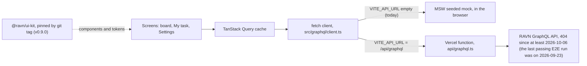

# Design

Written on 2026-10-06, after the app was built.

**The build follows Figma, except where the API or WCAG AA disagrees, and each exception is
written down with its reason.** Every screen has a distinct loading, error and success state,
and an empty state where one can occur; a test pins each one.

## How data reaches a screen

- The deployment takes the mock path today: `vercel.json` builds with `VITE_API_URL` empty.
  The three states of that setting are in [Deployment](deployment.md).
- React Query is the only cache. The client is one typed `fetch` call, so there is no
  second store to disagree with it (`README.md`, "Stack, and why").
- The kit is a separate package installed from a git tag. Read `package.json` for the tag
  actually installed (`grep ui-kit package.json`).

## States per screen

The strings are the ones a user sees or a screen reader hears. Each test name is in the file
named in the last column.

| Screen                | Loading                                   | Empty                                             | Error                                                                              | Success                                                            | Tests                                                 |
| --------------------- | ----------------------------------------- | ------------------------------------------------- | ---------------------------------------------------------------------------------- | ------------------------------------------------------------------ | ----------------------------------------------------- |
| Board, `/`            | Skeleton board, "Loading tasks" announced | "No tasks yet", pointing at the + button          | "Could not load the board" with Try again; no retry for a rejected token           | Five status columns with zero-padded counts; or the list layout    | `board-page.test.tsx`, `board.test.tsx`               |
| Board with filters    | Same skeleton                             | "No tasks match these filters" with Clear filters | Same as the board                                                                  | Only matching tasks; the filters are in the URL                    | `search-filter.test.tsx`                              |
| My task, `/my-task`   | Skeleton, "Loading your tasks"            | "No tasks assigned to you"                        | "Could not load your tasks" with Try again                                         | The signed-in user's tasks, list layout                            | `my-task-page.test.tsx`                               |
| Settings, `/settings` | Skeleton, "Loading your profile"          | None: there is always a signed-in user            | "Could not load your profile" with Try again; no retry for a rejected token        | Name, email, type, created and updated dates                       | `profile-page.test.tsx`                               |
| Create or edit dialog | Submit reads "Saving…" and is disabled    | A blank form on every open                        | The dialog stays open with the reason, and a notification, for a create or an edit | "Task created" or "Task updated"; the card is already on the board | `create-task.test.tsx`, `update-delete-task.test.tsx` |
| Delete confirmation   | Cannot be dismissed while the delete runs | Not applicable                                    | A notification, and the card comes back without a refetch                          | "Task deleted"                                                     | `update-delete-task.test.tsx`                         |

Two more states from the Design week list, and where they live:

- **Partial.** A refresh that fails over data already on screen keeps the data and shows a
  notice beside it, instead of the full error block (`src/ui/async-section/async-section.tsx`;
  test "KEEPS the content on screen when a refresh fails over data already loaded").
- **Permission denied.** The app has no login. The nearest case is a rejected API token,
  which gets the error block without a retry button, because retrying cannot fix it.

A banner says when the board runs on mock data ("says when the board is running on mocked
data rather than the live API", `board-page.test.tsx`).

**The effort field and the effort filter (F1).** One line per state. "Cannot happen" says why.
The placeholder "Effort" never shows: a new task's form starts at "Effort 0", an edited task's at
its own effort, and the filter at "Any effort".

| State             | The effort field, in the create or edit form                                                    | The effort filter                                                                                                            |
| ----------------- | ----------------------------------------------------------------------------------------------- | ---------------------------------------------------------------------------------------------------------------------------- |
| Empty             | Cannot happen: a new task starts at "Effort 0", and the API has no value for "unset"            | "Any effort", so nothing is filtered. A filter that matches nothing shows "No tasks match these filters" and keeps its value |
| Loading           | Cannot happen: the five options are built into the app, so nothing loads                        | The options never load. After a pick, the current cards stay until the narrowed list arrives                                 |
| Error             | Cannot happen for the field: every option is a valid value. A failed save is the dialog's error | A failed query shows the board's error block, not the no-results state                                                       |
| Success           | The chip reads "Effort N", with the help line under it                                          | Only the tasks with that effort; the choice is in the URL                                                                    |
| Partial           | Cannot happen: the options are not fetched, so none can be missing                              | As on the board: a failed refresh keeps the cards on screen, with a notice                                                   |
| Permission denied | Cannot happen: the app has no login, and the options need no request                            | As on the board: a rejected token gets the error block with no Try again                                                     |

Checked by: for the form's success line, `create-task.test.tsx` and `update-delete-task.test.tsx`
check the label, the description and the option names. The chip's text and the help line's place
under it are checked only in Chromium through Playwright (the verification pass below). The
filter's first four lines are checked in `search-filter.test.tsx`, and its last two by the board's
tests above. A "Cannot happen" line comes from the code: `task-form-dialog.tsx` sets the start
value, and the options are one constant, `EFFORT_ITEMS` in `task-display.ts`, for the form and the
filter.

## Where the build differs from Figma

| Figma draws                                                  | The build                                                            | Why                                                                                                      | Written in                                                      |
| ------------------------------------------------------------ | -------------------------------------------------------------------- | -------------------------------------------------------------------------------------------------------- | --------------------------------------------------------------- |
| White on `primary-4` for the main button                     | Ships as drawn, 3.83:1, below AA's 4.5:1                             | No colour in the palette fixes it; only a darker red would, and that is a brand change                   | `README.md`, "Decisions worth explaining"; kit Decisions §3     |
| Three status columns                                         | Five columns at the drawn 348px, and the row scrolls sideways        | The brief lists five statuses; the mockup predates the schema                                            | `README.md`, "Decisions worth explaining"                       |
| A search bar that is a `<button>`                            | A text field                                                         | A button cannot take typed text                                                                          | `README.md`, "Decisions worth explaining"                       |
| "4 Pts" on the card; "4 Points" under "Estimate" in the list | "Effort 4" on both, from the one effort formatter, under "Effort"    | P1 and P2 read points as priority in the interviews. Effort is a word they already know                  | `docs/product.md`; spec app#202                                 |
| No help line under a field                                   | One help line under the effort field, in the form and the filter     | P2 asked for an explanation of the field, and the spec rules out a tooltip or an info icon               | `docs/product.md`; spec app#202                                 |
| No field labels                                              | Every field has a label, visually hidden by default                  | A screen-reader user would otherwise meet an unnamed input                                               | kit Decisions §4                                                |
| Tag and badge labels in the same colour as their fill        | The fill stays as drawn; the label changes colour until it clears AA | The kit's rule: where Figma and accessibility collide, accessibility wins, and the ratio is written down | kit Decisions §2                                                |
| A `Position` field on the settings page                      | Not shown                                                            | The API's `User` type has no such field                                                                  | `README.md`, "Things the brief asks for that the API cannot do" |

**The call-to-action is the one place "accessibility wins" does not win.** The kit's first
rule is that no design value is invented, and the only fix here is a red Figma does not
contain. So it ships failing, the failure is asserted in the kit's
`src/styles/contrast.test.ts`, and the call belongs to whoever owns the brand.

**What is not checked.** The kit runs axe over every story in CI. The app runs no axe of its
own on its composed pages; that gap is in [the risk register](qa/risk-register.md).

## F1: the effort field

**Decision.** The field is called Effort and has one help line under it, in the form and in the
filter, because P1 and P2 read "points" as priority. Only the words and one help line change;
the API value, the data and the kit stay the same. The address keeps its `points` key and the
API's values, so a link shared before F1 still opens the same view.

**Tokens.** The app adds no colour, size or token of its own. The kit's components set every
value below.

- The help line is the kit `Select`'s `description`: `text-muted-on-dark` (`transparent-light-65`,
  `rgba(239, 240, 246, 0.65)`: #EFF0F6 at 65%), 12px from `text-xs`. `text-xs` is Tailwind's own
  size, not a kit token; the kit uses it for every field description.
- The chip is the kit `Select` trigger: `bg-neutral-2/10`, `rounded-4`, `h-8` (32px),
  `text-body-m` (15px) at weight 600, `text-main`.
- The card and the row: `text-main` on `surface-panel`, 15px, weight 600 on the card and 400 in
  the row.

**Accessibility, measured on 2026-10-07** in Chromium through Playwright, on `npm run dev` at
1440px. Contrast is against the background the text actually sits on.

| Check                              | Bar                       | Measured                                                                                 | Result                                                                                                                                                                              |
| ---------------------------------- | ------------------------- | ---------------------------------------------------------------------------------------- | ----------------------------------------------------------------------------------------------------------------------------------------------------------------------------------- |
| Help line contrast, form           | 4.5:1                     | 5.12:1 on `surface-overlay` (#393D41)                                                    | Meets                                                                                                                                                                               |
| Help line contrast, filter         | 4.5:1                     | 6.55:1 on `surface-shell` (#222528)                                                      | Meets                                                                                                                                                                               |
| "Effort 4" on the card and the row | 4.5:1                     | 13.45:1 on `surface-panel` (#2C2F33)                                                     | Meets                                                                                                                                                                               |
| Options in the open list           | 4.5:1                     | 10.95:1. The picked one: 5.43:1, and 6.67:1 under focus                                  | Meets                                                                                                                                                                               |
| Help line is the description       | A screen reader reads it  | `aria-describedby` points at it, in the form and the filter                              | Meets. Tests: criterion 1 in the [test map](qa/test-map.md#f1-one-row-per-acceptance-criterion), and 'labels the effort filter "Filter by effort" and explains it as the form does' |
| Target size, the chip              | 44×44                     | 144×32 in the form, 163×32 in the filter                                                 | **Does not meet**: 32px tall, as Figma draws the chip. It meets WCAG 2.2 AA's 24×24                                                                                                 |
| Target size, an option             | 44×44                     | 160×36                                                                                   | **Does not meet**: 36px tall                                                                                                                                                        |
| Never colour alone                 | No meaning in colour only | The effort is a word and a number. The picked option also has a check mark and bold text | Meets                                                                                                                                                                               |
| List headers tied to cells         | WCAG 1.3.1                | The header row is plain `div`s outside the `table`, with no `th`                         | **Does not meet**. The cell still reads "Effort 4", so it names itself                                                                                                              |

The three that do not meet are in the kit's `Select`, its option list and its `TaskTable`, so a
fix goes in the kit. F1 changes no code for them.

**Verification pass.**

- **Side by side with the reference screen: the intended change only.** The reference is
  `docs/screenshots/create-task.jpg`, the dialog before F1. The chip read "0 Points" and now reads
  "Effort 0", with the help line under it in three lines. The pickers keep their rows. Any other
  difference is older than F1.
- **Token check: pass, with one note.** Every colour, type size and radius on the chip, the help
  line, the card and the row is a kit token, except `text-xs` (above).
- **Accessibility check: 6 meet, 3 do not**, all 3 in the kit (the table above).
- **Layout check: pass after one fix.** Measured on 2026-10-07 in Chromium through Playwright, on
  `npm run dev`, at 1280, 1366 and 1440px, each with no filter set and with a status filter set.
  Before the fix, the effort filter was 397px wide, as wide as its help line on one line, and the
  filter bar took two rows in five of the six cases. After it (`w-min`, below), the filter is as
  wide as its chip, 163px, and the bar takes one row in all six. One case outside those six, at
  1280px with the effort filter set to "Effort 8", takes two rows: "Clear filters" needs 5px more
  than the row has. That was so before F1 too, because "8 Points" is wider than "Effort 8". At
  375px the bar wraps, as it did before F1. No text is cut or hidden, and no page scrolls sideways.
  The form was checked at 1440 and 375px. The card and the row were checked at 1440 and 375px when
  app#207 was built (Chromium through Playwright, 2026-10-07): "Effort 4" stays on one line in
  both, nothing overflows its box, and the page does not scroll sideways. On a phone the list
  view's table scrolls inside its own box, as it did before F1.

**A kit gap: the trigger stretches to the width of its description** (ravn-ui-kit#166). The kit
`Select` stacks the chip and the help line in one column, as wide as the help line on one line,
about 400px, and stretches the chip to fill it. The app passes `w-min` to a select only when it
gives it a description. The column is then as wide as the chip, so the chip keeps its own width
and the help line wraps under it. The line is still the control's accessible description.

**The help line costs height, not width, and that is accepted.** It adds three lines under the
effort chip, so the filter bar and the form's first row are taller. The filter row aligns its
items to the top, so the chips stay in line. The reason: the line is the fix. P2 asked for an
explanation, the spec rules out a tooltip or an info icon, and a shorter line would drop "not how
urgent it is", the part that answers the priority reading.

**Unresolved.**

- **The Figma file.** This repo does not link it, and it could not be opened here. The Figma
  values above (the 32px chip, "Pts", "Points" and "Estimate") come from the kit's source, which
  quotes Figma, not from the file.
- **The help line's size and spacing.** Figma draws no help line, so there is no design value to
  check them against. The line uses the kit's style for every field description.
