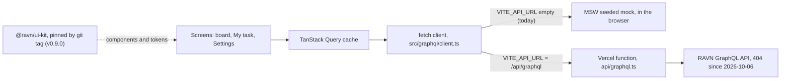

# Design

**The build follows Figma, except where the API or WCAG AA disagrees, and each exception is
written down with its reason.** Every screen has a distinct loading, empty, error and
success state, and a test pins each one.

## How data reaches a screen

- The deployment takes the mock path today: `vercel.json` builds with `VITE_API_URL` empty.
  The three states of that setting are in [Deployment](deployment.md).
- React Query is the only cache. The client is one typed `fetch` call, so there is no
  second store to disagree with it (`README.md`, "Stack, and why").
- The kit is a separate package installed from a git tag. Read `package.json` for the tag
  actually installed (`grep ui-kit package.json`).

## States per screen

The strings are the ones a user sees or a screen reader hears. Each test name is in the file
named in the last column.

| Screen                | Loading                                   | Empty                                             | Error                                                                       | Success                                                            | Tests                                                 |
| --------------------- | ----------------------------------------- | ------------------------------------------------- | --------------------------------------------------------------------------- | ------------------------------------------------------------------ | ----------------------------------------------------- |
| Board, `/`            | Skeleton board, "Loading tasks" announced | "No tasks yet", pointing at the + button          | "Could not load the board" with Try again; no retry for a rejected token    | Five status columns with zero-padded counts; or the list layout    | `board-page.test.tsx`, `board.test.tsx`               |
| Board with filters    | Same skeleton                             | "No tasks match these filters" with Clear filters | Same as the board                                                           | Only matching tasks; the filters are in the URL                    | `search-filter.test.tsx`                              |
| My task, `/my-task`   | Skeleton, "Loading your tasks"            | "No tasks assigned to you"                        | "Could not load your tasks" with Try again                                  | The signed-in user's tasks, list layout                            | `my-task-page.test.tsx`                               |
| Settings, `/settings` | Skeleton, "Loading your profile"          | None: there is always a signed-in user            | "Could not load your profile" with Try again; no retry for a rejected token | Name, email, type, created and updated dates                       | `profile-page.test.tsx`                               |
| Create or edit dialog | Submit reads "Saving…" and is disabled    | A blank form on every open                        | The dialog stays open with the reason, and a notification for an edit       | "Task created" or "Task updated"; the card is already on the board | `create-task.test.tsx`, `update-delete-task.test.tsx` |
| Delete confirmation   | Cannot be dismissed while the delete runs | Not applicable                                    | A notification, and the card comes back without a refetch                   | "Task deleted"                                                     | `update-delete-task.test.tsx`                         |

Two more states from the Design week list, and where they live:

- **Partial.** A refresh that fails over data already on screen keeps the data and shows a
  notice beside it, instead of the full error block (`src/ui/async-section/async-section.tsx`;
  test "KEEPS the content on screen when a refresh fails over data already loaded").
- **Permission denied.** The app has no login. The nearest case is a rejected API token,
  which gets the error block without a retry button, because retrying cannot fix it.

A banner says when the board runs on mock data ("says when the board is running on mocked
data rather than the live API", `board-page.test.tsx`).

## Where the build differs from Figma

| Figma draws                                           | The build                                                            | Why                                                                                                      | Written in                                                      |
| ----------------------------------------------------- | -------------------------------------------------------------------- | -------------------------------------------------------------------------------------------------------- | --------------------------------------------------------------- |
| White on `primary-4` for the main button              | Ships as drawn, 3.83:1, below AA's 4.5:1                             | No colour in the palette fixes it; only a darker red would, and that is a brand change                   | `README.md`, "Decisions worth explaining"; kit Decisions §3     |
| Three status columns                                  | Five columns at the drawn 348px, and the row scrolls sideways        | The brief lists five statuses; the mockup predates the schema                                            | `README.md`, "Decisions worth explaining"                       |
| A search bar that is a `<button>`                     | A text field                                                         | A button cannot take typed text                                                                          | `README.md`, "Decisions worth explaining"                       |
| No field labels                                       | Every field has a label, visually hidden by default                  | A screen-reader user would otherwise meet an unnamed input                                               | kit Decisions §4                                                |
| Tag and badge labels in the same colour as their fill | The fill stays as drawn; the label changes colour until it clears AA | The kit's rule: where Figma and accessibility collide, accessibility wins, and the ratio is written down | kit Decisions §2                                                |
| A `Position` field on the settings page               | Not shown                                                            | The API's `User` type has no such field                                                                  | `README.md`, "Things the brief asks for that the API cannot do" |

**The call-to-action is the one place "accessibility wins" does not win.** The kit's first
rule is that no design value is invented, and the only fix here is a red Figma does not
contain. So it ships failing, the failure is asserted in the kit's
`src/styles/contrast.test.ts`, and the call belongs to whoever owns the brand.

**What is not checked.** The kit runs axe over every story in CI. The app runs no axe of its
own on its composed pages; that gap is in [the risk register](qa/risk-register.md).
