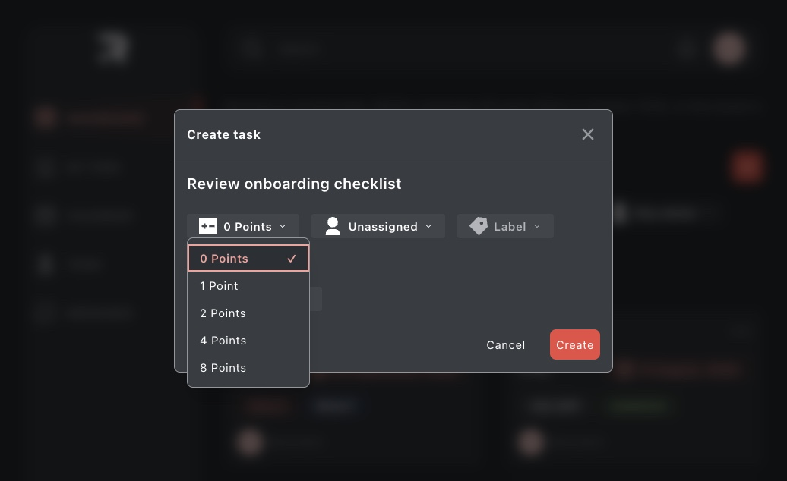
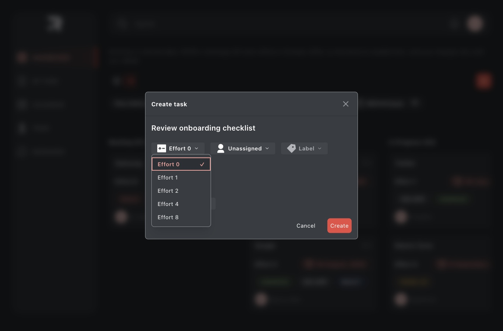

# Front interviews: two non-developers

Written on 2026-10-06, before the sessions. Two remote interviews on 2026-10-07, after the app
was built, with P1 and P2, neither of them a developer. Each session is a story-based interview,
then the problem statement read aloud, then a few minutes trying the deployed board. They test
the assumptions in the proto-persona (`docs/product.md`). They do not prove that the app is
usable for its real users.

They replace the usability test planned earlier, and keep its file name. The same day holds
one more interview, for another project; it does not appear here.

Every method line comes from the course content of the cohort's PM week and Design week, and
names its source. A line with no source is logistics.

## Research goals

Each goal is an assumption from `docs/product.md`, "The user and the problem", to confirm or
reject. An interview "should have research goals" ("User Interviews 101", NN/g, Design week
Tuesday), and the goals are the "key assumptions you want to validate or invalidate about your
customers' motivations and challenges" ("Jobs to be done for Product Managers", PM week Monday).

1. **Persona.** A member of a small team that plans its work on one shared board. They add work,
   give it an owner and a date, keep its status true, and point a teammate at the part of the
   board that matters. A persona starts as a guess, to "test your hypotheses later with user
   surveys/interviews" ("How to Create Product Personas + Examples", PM week Monday).
2. **Problem.** A small team needs one place that shows what work exists, who owns it and when it
   is due, and a way to hand a teammate exactly the slice they need. Block 4 tests it.
3. **Product.** Does the board help with the pain they describe? Block 5 tests it.

## Why this method, and what it cannot show

- **Interviews answer why and how.** "Qualitative research - interviews, usability sessions,
  open-ended observation - answers why and how" (Design week Tuesday brief).
- **The interview comes before the board.** A session can open with an interview and then turn
  to the product, as long as the questions do not "prime users to pay more attention to certain
  things in the design" ("User Interviews 101"). So the moderator does not mention the board or
  its features before block 5.
- **They think aloud on the board.** "If you can do only one activity and aim to improve an
  existing system, do qualitative (think-aloud) usability testing" ("UX Research Cheat Sheet",
  NN/g, Design week Tuesday).
- **Two people, not five to eight.** The course's rule of thumb is "five to eight users per user
  group" ("Qualitative vs. Quantitative UX Research", Design week Tuesday), and three to
  four stories, "enough to prevent you from overreacting to a single story" ("Opportunity
  Solution Trees", PM week Thursday). Two sessions are first signals, not patterns: "One vivid
  interview is an anecdote until you see the pattern repeat" (Design week Tuesday brief).
- **About 25 minutes, not an hour or more.** "JTBD interviews typically last 60-90 minutes"
  ("Jobs to be done for Product Managers"), and a session that combines an interview with a test
  is longer, "90 minutes rather than 60 minutes" ("User Interviews 101"). So each session keeps
  one story and few questions.
- **Friends, new to the app.** The participants are friends of the moderator, which raises
  "Social-desirability bias" ("User Interviews 101"), and "people report what they believe about
  themselves, which often differs from what they actually do" (Design week Tuesday brief).
  Neither runs a team's work on this board.
- **The app's persona only.** The persona of `@ravn/ui-kit`, the developer who builds with it,
  is not interviewed here.

## Setup

- **Where.** Remote, over Google Meet, which the moderator runs in Chrome. In block 5 the
  participant opens <https://ravn-task-management-challenge.vercel.app> in a new tab of their own
  desktop browser and shares their screen.
- **How long.** About 25 minutes each: P1 at about 10:30 (UTC-5), P2 at about 11:00.
- **Recording.** The moderator chose OBS Studio, which records their entire screen locally, with
  both voices. Zoom's local recording is the fallback, which would move the call to Zoom. Wispr
  Flow Notetaker writes the transcript. Recordings, transcripts and session notes stay outside
  this repository ([what stays out](#what-stays-out-of-this-repository)). The transcript stands
  in for a note-taker ("Jobs to be done for Product Managers").
- **Privacy.** No consent step: the participants are friends of the moderator, and the project
  is internal. Participants are named only as P1 and P2: no name, email or employer goes into
  any file or note, and names, emails, notifications and open tabs are cut from any clip. Full
  recordings and transcripts are deleted by 2026-10-23. Where quotes, clips and results go is in
  [what stays out](#what-stays-out-of-this-repository).
- **The board runs on seeded mock data.** RAVN's challenge API went offline in October 2026, so
  the deployment serves the same seeded tasks a fresh clone does (`docs/deployment.md`). A
  participant's changes live in their own tab until it reloads. A fresh tab is the reset between
  sessions, so P1 and P2 start from the same board. The banner above the board says so, and the
  moderator's opening line in block 5 says it once more.

## The session

Six blocks. The guide is flexible: the moderator skips, reorders or stays longer on a question
when the story is rich ("An interview guide can be used flexibly", "User Interviews 101").

| Block                    | P1, minutes | P2, minutes |
| ------------------------ | ----------- | ----------- |
| 1. Start easy            | 0-2         | 0-2         |
| 2. Background            | 2-4         | 2-4         |
| 3. The story             | 4-11        | 4-14        |
| 4. The problem statement | 11-13       | 14-16       |
| 5. Try the board         | 13-18       | 16-23       |
| 6. Close                 | 18-20       | 23-25       |

**How the moderator talks.** Slowly, without interrupting or rushing, acknowledging with "I see"
or "okay", or by echoing their words ("User Interviews 101"). The moderator gives no opinion and
captures "the customer's story in their own words without injecting your own opinions or
assumptions", and they "avoid leading or yes/no questions" ("Jobs to be done for Product
Managers"). The probes sit on an index card beside the screen: "Tell me more about that." "Can
you expand on that?" "Why is that important to you?" ("User Interviews 101"), and "What
alternatives did you consider?" ("Jobs to be done for Product Managers").

### 1. Start easy

> Thanks for doing this. I'm learning how small teams keep track of their work. First I'll ask
> about your own experience, then I'll show you something I built and ask what you think. What
> you tell me helps me decide what to change. There are no right or wrong answers.
>
> To start, tell me a bit about yourself and your work.

The course opens with "a warm introduction, explaining the purpose of the interview, and assuring
the participant that there are no right or wrong answers" ("Jobs to be done for Product
Managers"), then "questions that are easy to answer, such as Tell me a bit about yourself" ("User
Interviews 101").

### 2. Background

> Tell me a bit about your team. Who do you work with day to day?

A JTBD interview runs in three parts, "starting with background questions, diving into the
specific purchase story, and ending with reflective questions" ("Jobs to be done for Product
Managers"). Blocks 2, 3 and 6 are those parts.

### 3. The story

> Tell me about the last time you had to hand a piece of work to a teammate, or pick one up from
> someone. What happened?

Follow-ups, only for what the story has not covered:

- When did this happen? How long did it take you?
- Has this happened to you before?
- And how did you solve it?
- What did you use to keep track of it?
- What was going through your mind at that point?
- How did you feel during this experience?

"Good interviewers ask about specific past events ('tell me about the last time you hired a dog
walker'), not hypotheticals" (Design week Tuesday brief). The follow-ups follow the shape of
"User Interviews 101", "Jobs to be done for Product Managers" and the course's sample interview
transcript, "Vello_Interview_P01" (Design week Tuesday).

### 4. The problem statement

Read aloud, then pasted in the chat:

> A small team needs one place that shows what work exists, who owns it and when it is due, and
> a way to hand a teammate exactly the slice they need.
>
> Does this statement match your experience?

Whatever the answer: "Tell me more about that." The course takes the statement "to some of the
actual humans who might be facing this problem" and asks them "Does this statement resonate with
their lived experience?" ("The Product Management Problem Statement: How to Get it Right", PM
week Monday).

### 5. Try the board

The link is pasted in the chat.

> This is a task board I built. It runs on sample data, so nothing you do is saved. Please look
> around and use it however you like, and say what you think as you go.

The moderator watches without explaining. If they go quiet: "What do you think about that?"

> Is this right for the problem you described earlier?

Then: "Tell me more about that."

Testers "give the basic technology a try" and "focus on the functionality and the ability to
solve pain points" ("What is a Minimum Viable Product (MVP)? How to Get Started", PM week Tuesday
and Wednesday). The closing question is the course's: "This is the kind of content I want to
create. Is this right?" ("Minimum Viable Product (MVP) Example - The Handy Guide", the same
week).

### 6. Close

> What was better than you expected, and what was worse?
>
> Last thing. If a tool like this worked perfectly for your team, what would it do?
>
> That's everything. Thank you, this really helps.

The reflective close asks "What has been better than expected, and what has been worse?" ("Jobs
to be done for Product Managers"). The last question follows the sample transcript's "Last thing.
If a service like this existed and worked perfectly, what would it do?"

## After each session

Within 15 minutes, the moderator fills that participant's session notes, outside this
repository, in their words: "capture the problem or need in their words" ("User Stories With
Examples and a Template", Atlassian, PM week Friday). The notes hold:

- the story, in order;
- the patterns the course names: "Similar triggering events or struggling moments", "Common
  criteria or considerations", "Shared anxieties or hesitations" and "Recurring language or
  phrases" ("Jobs to be done for Product Managers");
- whether the problem statement resonates, partly or not at all, and why;
- what they did on the board and what they said, marked where the two differ;
- their answer to "Is this right?";
- each piece of feedback, weighed as "a core problem" or "a minor typo or personal preference"
  ("Minimum Viable Product (MVP) Example - The Handy Guide");
- what was better and what was worse than expected.

After both sessions, the synthesis reads across them, to "find the themes that recur, and distill
them into insights - statements about what's true for users - and then into problem statements"
(Design week Tuesday brief). Every claim in it is checked against the transcript before it comes
here: "The audit is not optional polish" (the same brief).

## What stays out of this repository

This repository is public, and its history keeps every version. So recordings, transcripts and
session notes stay outside it, because the notes hold quotes, reasons and word-for-word answers.
Quotes and clips of 60 seconds or less stay on an unlisted page shown to RAVN evaluators, never
here.

This repository holds only paraphrased findings, and whether the problem statement matched each
participant's experience. Repeated phrases and verbatim quotes stay in the session notes.

If a participant later asks, their results are removed from this repository, and earlier
versions stay in its history, de-identified.

## Results

The sessions ran on 2026-10-07. The paraphrased findings, the verdicts and what changes are in
[Product](../product.md#the-user-and-the-problem); notes and quotes stay outside this repository.

### The effort field: blind check, before and after

Spec app#202 renames the "Estimated points" field to "Effort" and adds a help line. Its success
measure is a blind check: a first-time user sees only the app and one task card, then says in
one sentence what the field means. **Pass:** the answer says amount or size of work, not
priority or urgency.

These runs are a rehearsal, not a user session.

| Run    | Date       | Production commit | Field name         | The answer says               | Result |
| ------ | ---------- | ----------------- | ------------------ | ----------------------------- | ------ |
| Before | 2026-10-07 | `dcdc7e2`         | "Estimated points" | size and effort               | Pass   |
| After  | 2026-10-08 | `297674f`         | "Effort"           | how much work, not how urgent | Pass   |

**Before, 2026-10-07.** The task card: "Create a task for a teammate. Then say, in one sentence,
what the Estimated points field means." The rehearsal's steps:

1. Opened the board, which held 7 seeded tasks.
2. Pressed the "+" button ("Create task"). The dialog opened.
3. Typed a title.
4. Opened the chip that read "0 Points". The options read "0 Points", "1 Point", "2 Points",
   "4 Points" and "8 Points".
5. Picked "2 Points".
6. Hovered the chip to look for an explanation. Nothing appeared.
7. Opened the assignee picker: "Unassigned" and four seeded users.
8. Picked a teammate.
9. Left the label empty and the status and due date as they were, and pressed "Create". The
   dialog closed and "Task created" showed.

The rule against quotes above is for participants, so the rehearsal's answer stays verbatim:

> Estimated points is the guessed size of a task, meaning how much effort it should take, picked
> from a 0, 1, 2, 4 or 8 scale and shown on each card as 'Pts', although the app never says what
> one point stands for.

It added that the answer was a guess, because nothing on screen defines the field.

**What this pass means.** The answer says size and effort, so the field passes before the
change. The rehearsal knows the term "story points", so it does not show the confusion P1 and
P2 showed. So these runs, before and after, can show only that the new words do not break
understanding. The real measure still needs a first-time human user. The pass rule stays as the
spec wrote it.

**The human run: not run.** A first-time human user is still the real measure and has no date.

**Friction with the field.** It has no visible label and no meaning on screen. The form shows
only a +/- icon and "0 Points". "Estimated points" is only its accessible name, and hovering
shows nothing.

_The create form on production at `dcdc7e2`, 2026-10-07, with the points list open._

**After, 2026-10-08.** Before the run, all five places on production at `297674f` (GitHub
deployment 6932434123) read "Effort": the form, the filter, the card, the list row and the
list's column header. The task card: "Create a task for a teammate. Then say, in one sentence,
what the Effort field means." The rehearsal's steps:

1. Opened the board, which held 7 seeded tasks. The help line already showed under the effort
   filter.
2. Pressed the "+" button ("Create task"). The dialog opened.
3. Typed a title.
4. Opened the Effort list, which started at "Effort 0". The options read "Effort 0", "Effort 1",
   "Effort 2", "Effort 4" and "Effort 8". The open list covered the help line.
5. Picked "Effort 2".
6. Opened the assignee picker, and paused to work out which user was the current one.
7. Picked a teammate.
8. Left the label empty and the status and due date as they were, and pressed "Create". "Task
   created" showed.
9. Found the new card on the board. It read "Effort 2".

The rehearsal's answer, verbatim:

> Effort is an estimate of how much work a task takes (not how urgent it is), picked from 0, 1,
> 2, 4 or 8, where 0 is tiny and 8 is big.

It took the answer from the help line, which it read under the filter and under the field.

**What this pass means.** The answer restates the help line, and the run before also passed. So
the runs show only that the new words are read and do not break understanding. They cannot
show that the change helps a person who is not a developer. The human run: not run. A
first-time human user is still the real measure and has no date.

**Friction with the field, after.**

- The open Effort list covers its own help line, so the value is picked with no explanation in
  view.
- The field starts at "Effort 0", and 0 also means "tiny". An effort nobody chose looks the same
  as a tiny one.
- Nothing gives a unit, or says why the steps double: 1, 2, 4, 8.

_The create form on production at `297674f`, 2026-10-08. The open Effort list covers the help
line._
